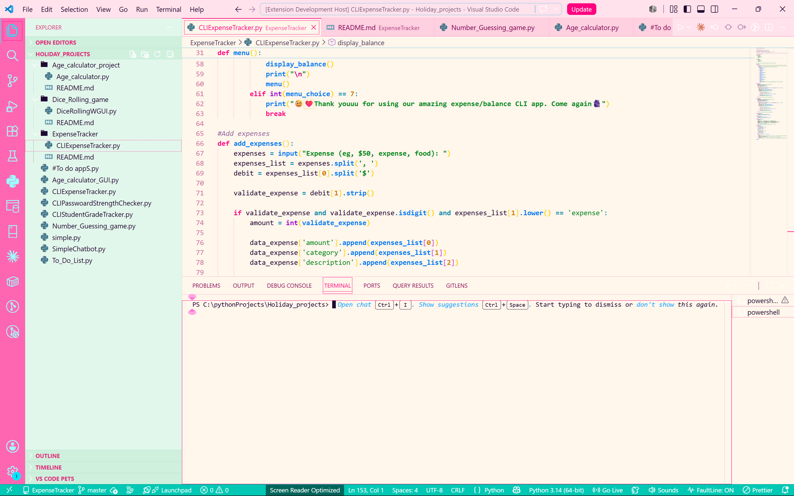
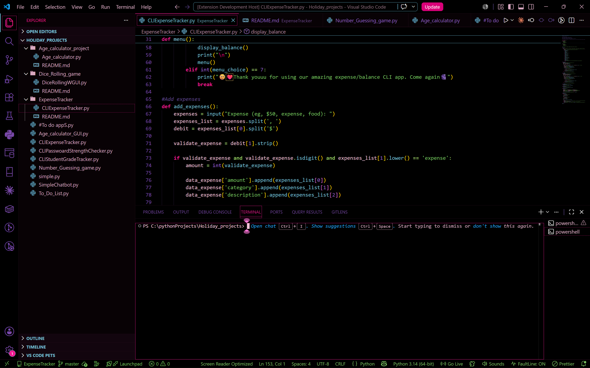

# Colortastic VS Code Themes 🌈✨

A collection of vibrant, celebration-inspired themes for Visual Studio Code. Inspired by the explosive colors of the **Diwali Festival**, the **Colortastic** series brings a rich spectrum of gulal pinks, marigold yellows, emerald greens, sunset oranges, and royal purples into your editor—balanced so no single color takes over.

---

## 🎨 Included Themes

### 1. Colortastic Light ☀️
A soft, non-glare light theme (`#F8FAFC`) designed to make bright festive colors pop comfortably without blinding your eyes during daytime coding.

### 2. Colortastic Dark 🌙
A rich, high-contrast dark theme (`#0F172A`) built for late-night coding sessions, letting glowing neon syntax colors burst against a sleek dark canvas.

---

## Previews

### Colortastic Light

### Colortastic Dark

---

## Installation

### Local Development / Manual Install
1. Copy the theme folder to your VS Code extensions directory:
   * **Windows:** `%USERPROFILE%\.vscode\extensions\`
   * **macOS / Linux:** `~/.vscode/extensions/`
2. Restart VS Code.
3. Open the Command Palette (`Ctrl+Shift+P` / `Cmd+Shift+P`).
4. Select **Preferences: Color Theme**.
5. Choose either **Colortastic Light** or **Colortastic Dark**.